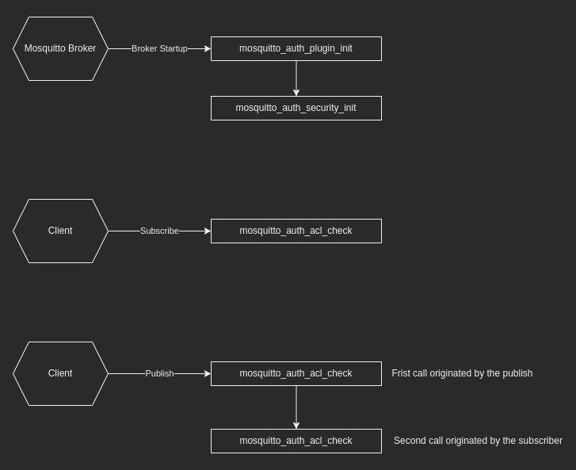

# Mosquitto Identity Plugin

In a IoT platform one of the most important thing is ensure that, each device will be access only the resources which device is allowed to access.
It's important because in IoT platform we don't know where our devices are and wo is with. So the basic security principle to reduce as much as we can
the access to our platform is extremely importante for IoT. With this in mind this plugin allow us to create an ACL for the [Mosquitto Broker](https://mosquitto.org/). Each user will have a group
of Permissions called Roles and these permissions will granted or deny the access for each topic, with that we can managed the publish and the subscription for each topic.


## Mosquitto Auth Workflow

The Mosquitto broker give us a external API to build a custom plugin. This API is exposed in the [mosquitto_plugin.h](https://mosquitto.org/api/files/mosquitto_plugin-h.html) and the mosquitto broker will called each function following the diagram bellow:

<div align="center">

</div>

### Requirements:
- Docker CE
- Rust LTS
```bash
asdf plugin-add rust https://github.com/code-lever/asdf-rust.git \
&& asdf install rust latest \
&& asdf global rust latest
```
- LLVM, CLang
```bash
sudo apt install llvm-dev libclang-dev clang
```
- Mosquitto, Mosquitto SDK
```bash
sudo apt install mosquitto-dev libmosquitto-dev
```

### Run the example
- If all of the requirements was accomplish use the Makefile docker command to run the example
```bash 
make docker 
```

### Referencies:
- [Embedded Rust](https://docs.rust-embedded.org/book/interoperability/rust-with-c.html)
- [Mosquitto Plugin Documentation](https://mosquitto.org/api/files/mosquitto_plugin-h.html)
- [Rust JWT Plugin](https://github.com/wiomoc/mosquitto-jwt-auth)

### Exemples
- [Rust Mosquitto Plugin](https://github.com/TotalKrill/mosquitto_plugin)